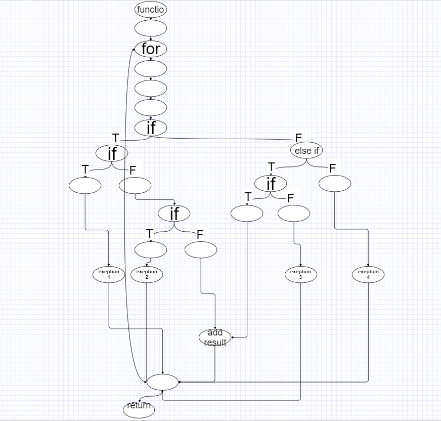

# Втора лабораториска вежба по Софтверско инженерство

## Марија Стризлоска, бр. на индекс 183139

### Група на код: 

Ја добив групата на код 6

###  Control Flow Graph

### Цикломатска комплексност

....

### Тест случаи според критериумот  Every statement 

....

### Тест случаи според критериумот Every path

.... 

### Објаснување на напишаните unit tests

...
...
